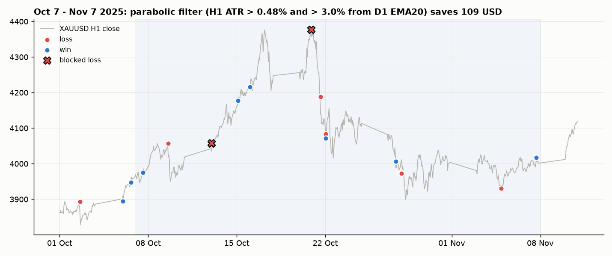
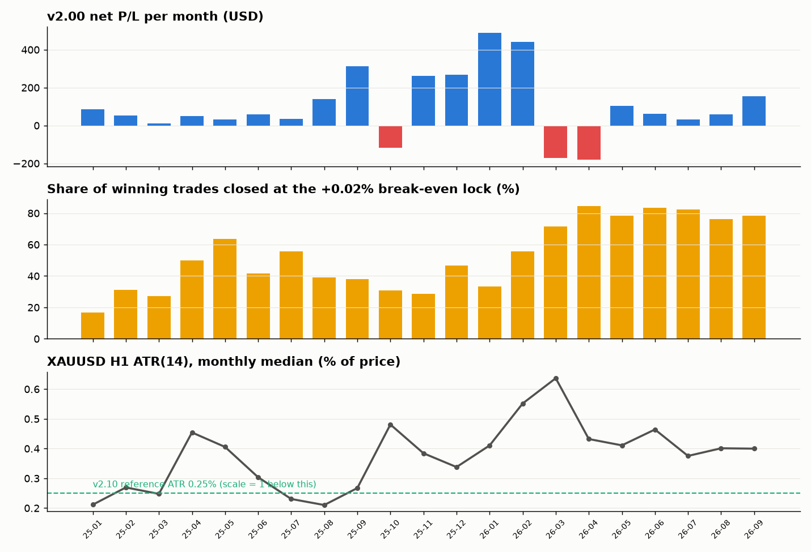

# GoldBreakoutMulti – EA สำหรับ XAUUSD (MT5)

EA ตัวเดียวที่พัฒนาต่อในโปรเจกต์นี้ใช้ **เวอร์ชันของผู้ใช้เป็นฐาน** (ผล backtest ดีที่สุด) แล้วเพิ่ม/ปรับทีละข้อจากข้อมูลจริง

- EA: [`MQL5/Experts/GoldBreakoutMulti.mq5`](MQL5/Experts/GoldBreakoutMulti.mq5) (v2.00)
- Preset: [`MQL5/Presets/GoldBreakoutMulti_v200.set`](MQL5/Presets/GoldBreakoutMulti_v200.set) ใช้ Load ใน Strategy Tester เพื่อกัน MT5 จำค่า input เก่า
- ข้อมูล: `data/` (รายงาน backtest, กราฟ balance, ราคา XAUUSD H1 ที่ผู้ใช้ส่งมา)
- เครื่องมือวิเคราะห์: `tools/`

## ผลของเวอร์ชันฐาน (2025.01.01 – 2026.09.28, M15, ทุน $1,000)

รายงาน: [`data/base_ea_report.xlsx`](data/base_ea_report.xlsx)

| รายการ | ค่า |
|---|---|
| กำไรสุทธิ | **+$1,596.62** |
| ไม้ทั้งหมด | 402 (ชนะ 81%) |
| Profit factor | 1.65 |
| Max equity DD | 14.25% |
| ขาดทุนสูงสุดต่อไม้ | −$80.56 |

ค่า input ที่ใช้ในรอบนี้ (M15, offset A −0.065 / B −0.05, Risk 2.5%, DD 20%, Fake filter Low, ปิดกลยุทธ์ C) **ถูกตั้งเป็นค่าเริ่มต้นในโค้ดแล้ว**

## v2.00: ลดการโดน SL ช่วง 7 ต.ค. – 7 พ.ย. 2568

**ปัญหา:** ช่วงนี้มี 21 ไม้ ขาดทุนรวม **−$231** (แพ้ 11 ไม้) ทองวิ่งแบบพาราโบลาขึ้น ATH 4,381 (20 ต.ค.) แล้วร่วง −6% ใน 21 ต.ค.
- A และ B เข้าที่เบรกเดียวกันเกือบพร้อมกัน พอเบรกหลอกจึงเสียพร้อมกัน 2 ไม้ (เช่น 13 ต.ค. −$54, 20 ต.ค. −$55)
- ความผันผวน H1 สูงกว่า SL 0.35–0.5% จน SL อยู่ในระยะแกว่งปกติของราคา

**วิธีหาตัวกรอง:** ทดสอบตัวกรองทุกแบบกับ **ไม้จริงทั้ง 402 ไม้** ([`tools/test_filters.py`](tools/test_filters.py)) ตัวที่รับได้ต้องช่วยช่วง ต.ค. **และไม่ทำให้ทั้ง 21 เดือนแย่ลง**

| ตัวกรอง | ช่วง ต.ค.–พ.ย. | ทั้ง 21 เดือน | สรุป |
|---|---|---|---|
| ห้ามเข้าช่วง 00:00–01:59 | +$96 | −$483 | ✗ ไม้ชนะหายเยอะ |
| หยุดหลังโดน SL ฝั่งเดียวกัน 24 ชม. | $0 | −$277 | ✗ |
| ไม่ให้กลยุทธ์ที่ 2 เข้าเบรกเดียวกัน | +$82 | −$678 | ✗ |
| D1 ATR% สูง | +$75–140 | −$220 ถึง −$980 | ✗ |
| H1 ATR% > 0.55 อย่างเดียว | +$62 | +$183 | ⚠ เปราะ (0.50 → −$201, 0.60 → −$12) |
| **H1 ATR% > 0.48 และราคาห่าง EMA20 (D1) > 3% ในทิศที่จะเข้า** | **+$109** | **+$67** | ✓ เป็นบวกทุกค่า 0.44–0.54 |

**ตัวกรองที่ใส่ (Parabolic filter):** ไม่วาง/ลบ Buy Stop เมื่อ ATR(14) ของ H1 > 0.48% ของราคา **และ** ราคาปิด D1 อยู่เหนือ EMA20 เกิน 3% (Sell Stop ใช้เงื่อนไขกลับด้าน) เงื่อนไขนี้คือ "ตลาดยืดตัวแรงและแกว่งหนัก" ซึ่งการเบรกขึ้นต่อมักเป็นเบรกหลอก

- ช่วง 7 ต.ค. – 7 พ.ย.: ขาดทุนจาก −$231 เหลือประมาณ **−$122** (ตัดไม้เสีย 4 ไม้ที่ 13 และ 20 ต.ค. ไม่ตัดไม้ชนะเลย)
- ทั้ง 21 เดือน: ตัด 14 ไม้ ดีขึ้นประมาณ **+$67**

| Input ใหม่ | ค่าเริ่มต้น | ความหมาย |
|---|---|---|
| `InpParaEnable` | true | เปิด/ปิดตัวกรอง |
| `InpParaAtrPct` | 0.48 | ATR(14) H1 เป็น % ของราคา |
| `InpParaStretchPct` | 3.0 | ราคาปิด D1 ห่าง EMA ในทิศที่จะเข้า (%) |
| `InpParaAtrPeriod` / `InpParaEmaPeriod` | 14 / 20 | คาบ ATR (H1) / EMA (D1) |

**ข้อจำกัด:** ตัวเลขข้างบนเป็นการประมาณจากการตัดไม้ออกจากผลเดิม ในการเทสจริง ไม้ที่ถูกตัดอาจทำให้ไม้ถัดไปเปลี่ยน (เช่น จำกัดไม้ต่อวัน, lot ที่คิดจาก balance) ต้องยืนยันด้วยการรัน Strategy Tester อีกครั้ง
ไม้เสียที่เหลือ (9 ต.ค., 28 ต.ค., 4 พ.ย.) ไม่มีตัวกรองไหนตัดได้โดยไม่เสียกำไรช่วงอื่นมากกว่า

## วิธีเทส
1. คัดลอก `MQL5/Experts/GoldBreakoutMulti.mq5` ไปที่ `MQL5/Experts/` ของ MT5 แล้ว Compile
2. คัดลอก `MQL5/Presets/GoldBreakoutMulti_v200.set` ไปที่ `MQL5/Presets/`
3. Strategy Tester: XAUUSD, **M15**, 2025.01.01 – 2026.09.28, Every tick based on real ticks
4. แท็บ Inputs → คลิกขวา → **Load** → เลือกไฟล์ `.set`
5. เทียบกับฐาน: ตั้ง `InpParaEnable=false` จะได้ผลเท่ากับเวอร์ชันฐาน

## ผลเทส v2.00 (ยืนยันแล้ว)

รายงาน: [`data/v200_report.xlsx`](data/v200_report.xlsx)

| | ฐาน | **v2.00** |
|---|---|---|
| กำไรสุทธิ | +$1,596.62 | **+$2,108.25** |
| Profit factor | 1.65 | **1.74** |
| ชนะ | 81% | 82% |
| Max equity DD | 14.25% | 17.11% |

## ทดลอง v2.10 (ยกเลิกแล้ว): ปรับ break-even/trailing ตาม ATR

- **ปัญหาที่ดู:** ช่วง ก.พ.–ก.ย. 2026 พอร์ตไม่โต ไม้ชนะเฉลี่ยลดจาก +0.20% เหลือ +0.10% และ 78% ของไม้ชนะออกที่จุด break-even (+0.02%)
- **สิ่งที่ลอง:** v2.10 คูณระยะ break-even และ trailing ตาม ATR(H1) ÷ 0.25%
- **ผล:** ผู้ใช้เทสแล้ว **v2.00 ดีกว่า** จึงย้อนกลับเป็น v2.00 ตัวกรองนี้จึงไม่ใช่ทางแก้ของช่วงปี 2026
