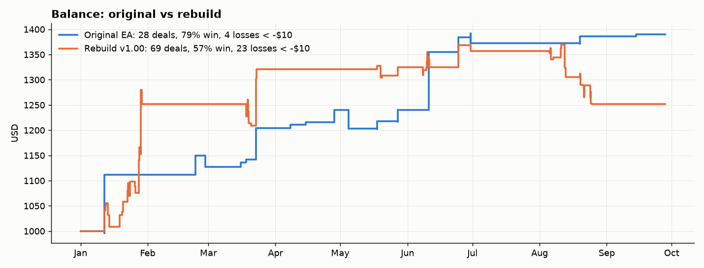
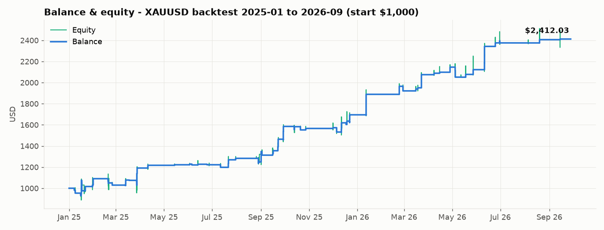
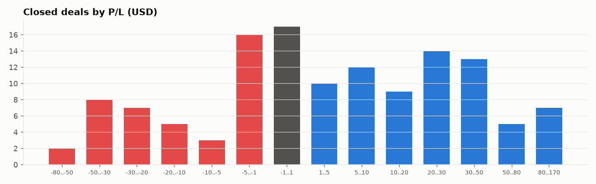
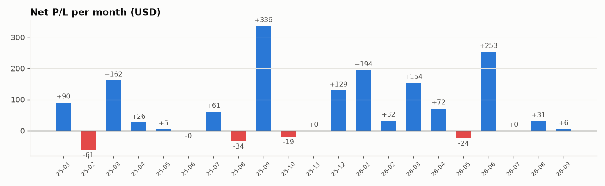

# GoldBreakoutMulti – EA สำหรับ XAUUSD (MT5)

EA ตัวนี้เขียนขึ้นใหม่จากพฤติกรรมที่เห็นใน backtest ของ EA ต้นฉบับ (ภาพหน้าจอ Strategy Tester + ไฟล์ `testergraph.report.2026.09.28.csv`)
ไม่ได้ถอดรหัสจากไฟล์ `.ex5` ค่าต่างๆ จึงเป็นค่า **ประมาณ** ที่อนุมานจากออเดอร์ที่เห็นในภาพ ควรเอาไป Optimize ต่อใน Strategy Tester

- ไฟล์ EA: [`MQL5/Experts/GoldBreakoutMulti.mq5`](MQL5/Experts/GoldBreakoutMulti.mq5)
- สคริปต์วิเคราะห์: [`tools/analyze_backtest.py`](tools/analyze_backtest.py), [`tools/decode_orders.py`](tools/decode_orders.py)
- ข้อมูล backtest (แปลงเป็น UTF-8 แล้ว): [`data/backtest_equity_2026.csv`](data/backtest_equity_2026.csv)

---

## 1. ผล backtest ของระบบต้นฉบับ (1 ม.ค. – 27 ก.ย. 2026, ทุน $1,000)

| รายการ | ค่า |
|---|---|
| ยอดเงินสุดท้าย | **$1,390.19 (+39.0%)** |
| ดีลที่ปิดแล้ว | 28 ดีล (ชนะ 22 / แพ้ 6 = **ชนะ 79%**) |
| Profit factor | **5.77** |
| กำไรเฉลี่ยต่อดีล / ขาดทุนเฉลี่ยต่อดีล | +21.64 / −13.74 |
| กำไรสูงสุด / ขาดทุนสูงสุด | +62.69 / −20.60 |
| Equity drawdown สูงสุด | **−7.10%** |
| ค่าคอมมิชชัน | 0.07 ต่อ 0.01 lot |

**ข้อสังเกต**
- เทรดน้อยมาก ประมาณ 1–3 ครั้งต่อเดือน และบางเดือนไม่มีเทรดเลย (ตั้ง TradeFrequency ไว้ที่ "extreme conservative")
- ออเดอร์ส่วนใหญ่ถือไม่กี่นาทีถึงไม่กี่ชั่วโมง มักเข้าตอนราคาพุ่งแรง แล้ว trailing stop ล็อกกำไรไว้เร็ว
- ดีลขาดทุนเสียน้อยกว่า SL จริงมาก เพราะ trailing ขยับ SL ขึ้นมาก่อนราคาจะกลับตัว

## 2. แกะระบบจากออเดอร์ในภาพหน้าจอ

อ่านออเดอร์ Pending ทั้ง 15 ตัวจากภาพ 3 ภาพ แล้วคำนวณระยะ SL/TP ของแต่ละตัว
ผลคือทุกออเดอร์แบ่งได้ลงตัวเป็น **3 กลยุทธ์ย่อย** โดย SL/TP ของแต่ละกลยุทธ์คิดเป็น **% ของราคา** ไม่ใช่จำนวนจุดคงที่

| Ticket | วันที่วาง | ประเภท | Entry | SL (จุด) | TP (จุด) | TP/SL | SL % ของราคา | กลยุทธ์ |
|---|---|---|---|---|---|---|---|---|
| 3 | 2026-01-01 23:10 | buy stop | 4546.32 | 2170 | 8895 | 4.10 | 0.50% | A |
| 4 | 2026-01-01 23:10 | sell stop | 3888.20 | 2170 | 8895 | 4.10 | 0.50% | A |
| 5 | 2026-01-01 23:10 | buy stop | 4547.19 | 1519 | 7159 | 4.71 | 0.35% | B |
| 6 | 2026-01-04 23:05 | sell stop | 4277.23 | 1522 | 7175 | 4.71 | 0.35% | B |
| 9 | 2026-01-07 21:15 | buy stop | 4543.90 | 13544 | 3219 | 0.24 | 3.04% | C |
| 22 | 2026-01-29 17:00 | sell stop | 3888.49 | 2586 | 10603 | 4.10 | 0.48% | A |
| 23 | 2026-02-01 23:05 | buy stop | 5595.15 | 1903 | 8973 | 4.72 | 0.39% | B |
| 25 | 2026-02-02 00:05 | buy stop | 5594.59 | 2414 | 9898 | 4.10 | 0.51% | A |
| 27 | 2026-02-04 23:02 | buy stop | 5592.13 | 14562 | 3461 | 0.24 | 2.97% | C |
| 28 | 2026-02-05 00:05 | sell stop | 4405.95 | 1732 | 8163 | 4.71 | 0.35% | B |
| 44 | 2026-02-20 00:05 | sell stop | 4842.92 | 1742 | 8210 | 4.71 | 0.35% | B |
| 49 | 2026-02-25 21:15 | buy stop | 5591.49 | 15968 | 3796 | 0.24 | 3.08% | C |
| 50 | 2026-02-26 00:05 | buy stop | 5247.36 | 1801 | 8492 | 4.72 | 0.35% | B |
| 52 | 2026-02-26 17:00 | sell stop | 4404.78 | 2573 | 10551 | 4.10 | 0.50% | A |
| 53 | 2026-02-27 00:05 | buy stop | 5246.32 | 2582 | 10585 | 4.10 | 0.50% | A |

> "SL % ของราคา" คำนวณเทียบกับราคาตลาดโดยประมาณ ณ ตอนวางออเดอร์ ซึ่งอ่านจากกราฟในภาพ

| กลยุทธ์ | SL | TP | TP/SL | ทิศทาง | จุดเข้า |
|---|---|---|---|---|---|
| **A** | 0.50% | 2.05% | 4.1 | Buy + Sell | High/Low ของช่วงยาว (~600 แท่ง H1) |
| **B** | 0.35% | 1.65% | 4.7 | Buy + Sell | High/Low ของช่วงกลาง (~340 แท่ง H1) |
| **C** | 3.00% | 0.72% | 0.24 | Buy เท่านั้น | High ของช่วงยาวมาก (~900 แท่ง H1) |

**หลักการทำงาน**

1. ทุกครั้งที่เปิดแท่ง H1 ใหม่ แต่ละกลยุทธ์จะหาจุดสูงสุด/ต่ำสุดในช่วง Lookback ของตัวเอง (Donchian channel)
2. วาง **Buy Stop** ต่ำกว่าจุดสูงสุดเล็กน้อย และ **Sell Stop** สูงกว่าจุดต่ำสุดเล็กน้อย ในภาพ Buy Stop ของทั้ง 3 กลยุทธ์อยู่ใต้ All-time high ประมาณ 0.05–0.11%
3. ตั้ง SL/TP เป็น % ของราคาเข้า
4. เมื่อราคาทะลุระดับและออเดอร์ถูก fill แล้วได้กำไรถึงระดับที่ตั้งไว้ SL จะขยับตาม **Low (Buy) / High (Sell) ของ N แท่งล่าสุด** ใน TF เล็ก (HL Trailing)
5. ถ้าระดับเปลี่ยน EA จะย้ายราคาออเดอร์ตาม แทนการตั้งวันหมดอายุ (virtual expiration) ถ้าราคาอยู่ใกล้ระดับเกินไป (fake breakout filter) หรือทะลุไปแล้ว EA จะลบออเดอร์ทิ้ง ไม่ไล่ราคา
6. ตัวกรอง: Spread สูงสุด, ปิดทุกอย่างก่อน NFP, และปิดวันศุกร์ (ปิดไว้เป็นค่าเริ่มต้น เหมือนต้นฉบับที่ตั้งเป็น 25)

## 3. Inputs ที่เหลือ (ตัดตัวที่ไม่จำเป็นออกแล้ว)

**ตัดออก:** InfoPanel ทั้งหมด, BacktestSpeed, Randomization, Propfirm adjust (AdjustEntry/SL/TP…), RemoveCommentSuffix, UseVariableValues, setSL_TP_After_Entry, AutoGMT/GMT offset (NFP ตรงกับ 15:30 เวลาโบรกเกอร์ที่ใช้ GMT+2/+3 ทั้งหน้าร้อนและหน้าหนาว), Daily DD (propfirm), OnlyUp, ResetHighestBalance, Use Equity

| กลุ่ม | Input | ค่าเริ่มต้น | ความหมาย |
|---|---|---|---|
| General | `InpRefreshTF` / `InpMinLevelAge` / `InpMaxTradesDay` | D1 / 24 / 1 | ดูหัวข้อ 6 |
| | `InpMagicBase` | 8000 | Magic ของกลยุทธ์ A/B/C คือ 8001/8002/8003 |
| | `InpAllowBuy` / `InpAllowSell` | true | เปิด/ปิดฝั่ง Buy หรือ Sell ทั้งระบบ |
| | `InpSignalTF` | H1 | TF ที่ใช้หาระดับ High/Low |
| | `InpMaxSpreadPts` | 500 | ถ้า spread เกินค่านี้ EA จะลบ pending ไว้ก่อน |
| Lot | `InpLotMode` | Risk % | Fixed lot หรือ % ความเสี่ยงต่อกลยุทธ์ |
| | `InpFixedLot` | 0.01 | lot คงที่ และเป็น lot ขั้นต่ำในโหมด Risk |
| | `InpRiskPercent` | 1.0 | % ของ balance ที่ยอมเสียต่อ 1 ออเดอร์ |
| | `InpMaxTotalDDPct` | 30 | หยุดเปิดออเดอร์ใหม่เมื่อ equity ต่ำกว่า balance สูงสุด X% |
| | `InpCheckMargin` | true | เช็ค free margin ก่อนวางออเดอร์ |
| Filters | `InpFakeFilter` | Medium | ระยะขั้นต่ำระหว่างราคากับระดับ (Low 0.05% / Med 0.15% / High 0.30%) |
| | `InpFridayStopHour` | 25 | ชั่วโมงหยุดวันศุกร์ (25 = ปิดฟังก์ชัน) |
| NFP | `InpNfpEnable` … | 100 นาทีก่อน / 60 นาทีหลัง | ปิด/ลบออเดอร์รอบข่าว NFP |
| Trailing | `InpUseHLTrail`, `InpTrailTF`, `InpTrailBars` | true, M5, 3 | Trailing SL ตาม High/Low ของ N แท่ง |
| Strategy A/B/C | Enable, Direction, Lookback, EntryOffset, SL%, TP%, TrailStart% | ดูตารางด้านบน | ตั้งค่าแยกรายกลยุทธ์ |

## 4. วิธีติดตั้งและทดสอบ

1. คัดลอก `MQL5/Experts/GoldBreakoutMulti.mq5` ไปไว้ที่ `<MT5 Data Folder>/MQL5/Experts/`
2. เปิด MetaEditor แล้ว Compile (F7)
3. ใน Strategy Tester เลือก **XAUUSD, H1**, Modelling = **Every tick based on real ticks** (เพราะ trailing ทำงานในระดับนาที)
4. ช่วงแรกให้ทดสอบด้วย `InpLotMode = Fixed lot 0.01` เพื่อเทียบกับผลต้นฉบับ แล้วค่อย Optimize ค่า `Lookback`, `EntryOffset`, `TrailStart`, `InpTrailBars`

## 5. ข้อจำกัด (ควรรู้)

- ค่า **SL%/TP%** อนุมานจากออเดอร์ 15 ตัวที่เห็นในภาพ ค่าที่ได้ตรงกันทุกออเดอร์ จึงเชื่อถือได้สูง
- ค่า **Lookback, EntryOffset, TrailStart, TrailBars** เป็นการประมาณจากภาพ มีบางออเดอร์ที่อธิบายด้วย lookback เดียวไม่ได้ เช่น Sell Stop ที่ 3888 ของกลยุทธ์ A ดังนั้น **ต้อง Optimize ต่อ**
- สูตรคำนวณ lot แบบ "Max Allowed Total Drawdown / Weighted Lotsize" ของต้นฉบับไม่สามารถแกะได้จากข้อมูลที่มี จึงใช้ Risk % ต่อกลยุทธ์แทน
- ในภาพไม่มีรายละเอียดของ Fake Breakout Filter ของต้นฉบับ ตัวกรองใน EA นี้เป็นการตีความใหม่ (ระยะขั้นต่ำระหว่างราคากับระดับ)
- ผล backtest ในอดีตไม่รับประกันผลในอนาคต ควรทดสอบบนบัญชี Demo ก่อนใช้เงินจริง

## 6. ผลเทส v1.00 เทียบกับต้นฉบับ และสิ่งที่แก้ใน v1.10

| | ต้นฉบับ | Rebuild v1.00 |
|---|---|---|
| ดีลที่ปิด | 28 | 69 |
| ชนะ | 79% | 57% |
| ขาดทุนเกิน $10 (โดน SL เต็ม) | 4 | 23 |
| Profit factor | 5.77 | 1.50 |
| Max DD | 7.1% | 10.1% |

**สาเหตุหลักที่ v1.00 โดน SL บ่อย**
1. **เข้าซ้ำในวันเดียวกันหลายรอบ** เช่น 10 มิ.ย. เข้าไปกว่า 10 ไม้ และเดือน ส.ค. 18 ไม้ ขณะที่ต้นฉบับเข้าแค่ 1–6 ไม้ต่อเดือนเท่านั้น
2. **ไล่ High/Low ที่เพิ่งเกิดขึ้นในช่วงเทรนด์** เดือน ม.ค. ต้นฉบับเข้าแค่ 11–12 ม.ค. แล้วหยุดเลย แต่ v1.00 เข้าเกือบทุกวันตลอดขาขึ้น
3. **Entry offset ติดลบ** ทำให้ Buy Stop อยู่ต่ำกว่า High จริง จึงไปซื้อตรงจุดที่ราคาเด้งลง (double top) ก่อนจะทะลุจริง

**สิ่งที่แก้ใน v1.10** (ดูจากภาพต้นฉบับ: ออเดอร์ส่วนใหญ่วางตอน 00:05/23:05 และใช้ระดับที่เกิดขึ้นมาแล้ว 2–6 วัน)

| Input ใหม่ | ค่าเริ่มต้น | ผล |
|---|---|---|
| `InpRefreshTF` | D1 | วาง/ย้ายออเดอร์ **วันละครั้ง** ตอนเปิดแท่งวัน (เดิมทำทุกชั่วโมง) |
| `InpMinLevelAge` | 24 | High/Low ต้องเกิดมาแล้วอย่างน้อย 24 แท่ง H1 ถ้าเป็นระดับที่เพิ่งเกิดจะไม่วางออเดอร์ |
| `InpMaxTradesDay` | 1 | แต่ละกลยุทธ์เข้าได้ไม่เกินวันละ 1 ไม้ต่อฝั่ง |
| `InpBEPct` / `InpBELockPct` | 0.15% / 0.02% | ได้กำไร 0.15% แล้วเลื่อน SL มาที่ทุน + 0.02% |
| `EntryOffset` A/B/C | 0.0 | วางที่ High/Low จริง ไม่วางก่อนถึงระดับ |

ถ้ายังเข้าบ่อยเกินไป ให้เพิ่ม `InpMinLevelAge` (เช่น 36–48) ถ้าเข้าน้อยเกินไป ให้ลดลง หรือเปลี่ยน `InpRefreshTF` เป็น H4

## 7. ข้อมูลต้นฉบับย้อนหลังยาว (ม.ค. 2025 – ก.ย. 2026) และ v1.20

ข้อมูล: [`data/original_long.csv`](data/original_long.csv)

| รายการ | ต้นฉบับ 2025–2026 |
|---|---|
| ทุน → ยอดสุดท้าย | $1,000 → **$2,412 (+141%)** |
| ดีลที่ปิด | 128 (ชนะ 70 / แพ้ 58, 55%) |
| Profit factor | 2.99 |
| กำไรเฉลี่ยต่อดีล / ขาดทุนเฉลี่ยต่อดีล | +30.63 / −12.35 |
| Max equity DD | −15.8% |

**สิ่งที่เห็นจากข้อมูลยาว** (ประมาณราคาทองจาก Deposit Load: margin ของ 0.01 lot ≈ ราคา/100 ที่ leverage 1:100 เช่น ม.ค. 2025 ≈ 2,690)
- **ต้นฉบับก็แพ้บ่อย (45%) แต่ส่วนใหญ่เสียน้อยมาก:** กองใหญ่ที่สุดของดีลอยู่ช่วง −5 ถึง +5 USD แสดงว่าส่วนใหญ่ออกที่จุด break-even (+0.04–0.17% ของราคา) ไม่ได้โดน SL เต็ม
- **ไม้ชนะวิ่งไปถึงขนาดประมาณ TP:** เช่น +73.77 ที่ 0.01 lot (≈ 2.1%) และ +71.58 (≈ 1.9%) ซึ่งตรงกับ TP ของกลยุทธ์ A ต้นฉบับไม่ได้ตัดกำไรเร็วด้วย trailing แคบๆ
- **เข้าซ้ำหลายครั้งในช่วงเดียวกัน:** เช่น 15–16 ม.ค. 2025 และ 30 ม.ค. 2025 เข้าหลายไม้ ไม้ที่ออกที่ break-even แทบไม่เสียเงิน จนไม้ที่ทะลุจริงวิ่งยาว
- ต้นปี 2025 เทรดถี่ (ม.ค. ~34 ไม้) แต่ปี 2026 เหลือ 2–4 ไม้ต่อเดือน

**สิ่งที่แก้ใน v1.20**

| Input | v1.10 | v1.20 | เหตุผล |
|---|---|---|---|
| `InpBEPct` / `InpBELockPct` | 0.15 / 0.02 | **0.25 / 0.05** | ออกที่ break-even ในระดับเดียวกับต้นฉบับ (+0.04–0.17%) |
| `InpA/B/C_TrailStart` | 0.20 / 0.20 / 0.15 | **1.00 / 0.80 / 0.40** | ให้ไม้ชนะวิ่งไปถึง TP ก่อนเริ่ม trailing |
| `InpTrailTF` / `InpTrailBars` | M5 / 3 | **M15 / 5** | trailing หลวมขึ้น ไม่โดน noise ปัดตก |
| `InpMaxTradesDay` | 1 | **3** | เข้าซ้ำได้หลังออกที่ break-even |
| `InpMaxLossesDay` (ใหม่) | – | **1** | ถ้าขาดทุนจริง 1 ไม้ กลยุทธ์นั้นหยุดทั้งวัน กันการโดน SL ซ้ำ |
| re-arm หลังปิดไม้ | รอวันถัดไป | **วางออเดอร์ใหม่ทันที** | เหมือนต้นฉบับที่เข้าซ้ำในชั่วโมงเดียวกัน |

**ข้อจำกัด:** ไฟล์ testergraph เก็บแค่ balance/equity/load ที่ถูกย่อจุดไว้ จึงจับคู่ไม้เข้า-ออกทีละไม้ได้ไม่แม่น ถ้าต้องการปรับให้ใกล้ต้นฉบับกว่านี้ ต้องใช้ **รายงาน Deals** จาก Strategy Tester (คลิกขวาที่แท็บ Backtest → Report → Save as HTML/XLSX)

## 8. ผลเทส v1.20 และสิ่งที่แก้ใน v1.30

v1.20 (ม.ค. 2025 – ก.ย. 2026): $1,000 → ~$1,575 (+57%) ส่วนต้นฉบับได้ +141%

**ทำไมกำไรน้อยกว่า**
1. **Lot เล็กกว่า:** v1.20 ใช้ Risk 1% ต่อกลยุทธ์ ทำให้เข้าแทบทุกไม้ที่ 0.01 lot ส่วนต้นฉบับเข้า 0.02–0.03 lot ตั้งแต่ทุน $1,000 และขยายเป็น 0.06 lot เมื่อทุนโต (ดูจาก commission −0.14/−0.21/−0.42 ต่อไม้)
   ค่า lot ของต้นฉบับตรงกับสูตร **Max Allowed Total Drawdown 30%** คือ lot = balance × 30% ÷ ผลรวม SL ของทุกกลยุทธ์ ที่ $1,000 และราคา 2,690: 300 ÷ (13.45 + 9.4 + 80.7 ต่อ 0.01 lot) ≈ 0.029 lot
2. **กลยุทธ์ C โดน SL เต็ม 3%:** ช่วงทองร่วงแรง ก.พ. 2025 และ 21 ต.ค. 2025 (−6% ในวันเดียว) เป็นสาเหตุของ 2 หลุมใหญ่ในกราฟ v1.20
   ตลอด 21 เดือนต้นฉบับไม่เคยเสียเต็ม 3% เลย ไม้ที่เสียมากสุดประมาณ 0.9–1% ของราคา (−70.41 ที่ 0.03 lot, −30.30 ที่ 0.01 lot) แสดงว่า **HL Trailing SL ของต้นฉบับทำงานตั้งแต่เปิดไม้** และดึง SL ขึ้นมาไว้ใต้ Low ของแท่ง H1 ล่าสุดทันที

**v1.30**

| Input | v1.20 | v1.30 |
|---|---|---|
| `InpLotMode` | Risk % | **Max allowed total drawdown** (สูตรเดียวกับต้นฉบับ, 30%) |
| `InpTrailTF` | M15 | **H1** |
| `InpA/B/C_TrailStart` | 1.00 / 0.80 / 0.40 | **0** (trailing ทำงานตั้งแต่เปิดไม้ ขยับ SL ให้แคบลงเท่านั้น) |

ผลที่ควรเห็น: lot ใหญ่ขึ้นประมาณ 2–3 เท่า และโตตามทุน ส่วนไม้ที่ขาดทุนหนักของกลยุทธ์ C ควรถูกจำกัดไว้ที่ Low ของ 5 แท่ง H1 แทน 3% ถ้า DD สูงเกินที่รับได้ ให้ลด `InpMaxTotalDDPct` เป็น 20–25
